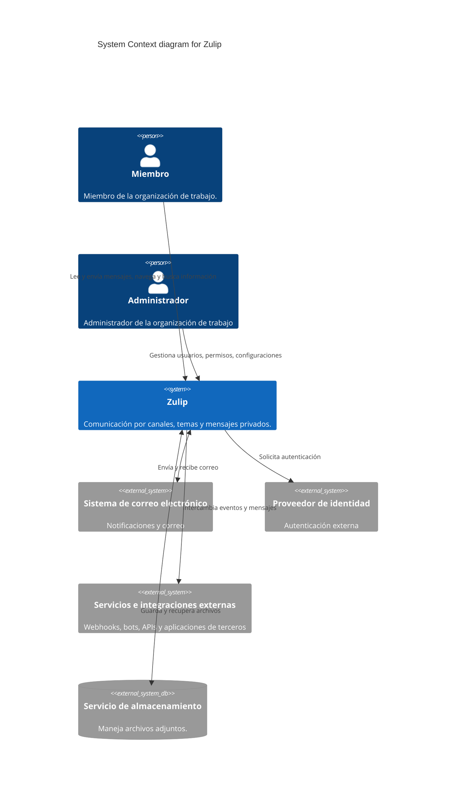

# Diagrama de contexto — C4 nivel 1

El diagrama representa a Zulip, sus usuarios y los servicios externos
que pueden participar según la configuración del despliegue.
Los servicios externos no forman parte de las mejoras propuestas.

